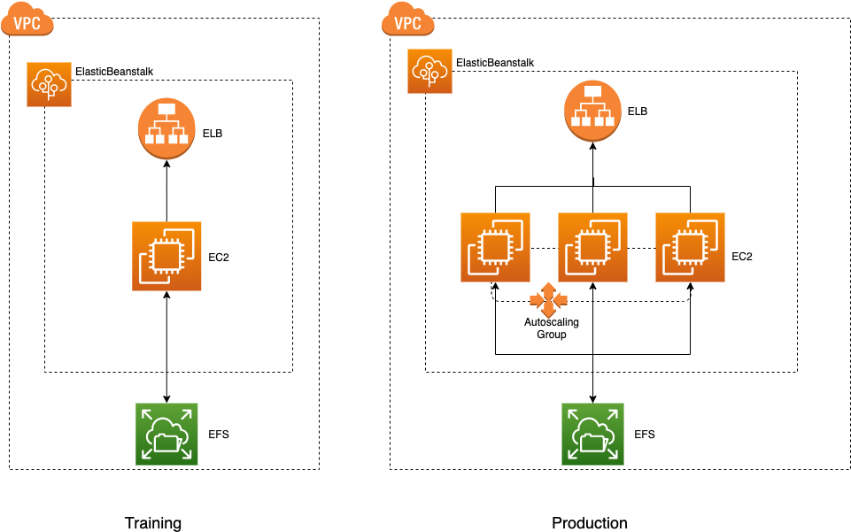
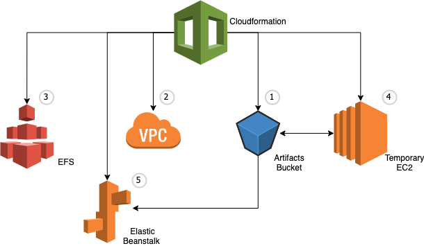
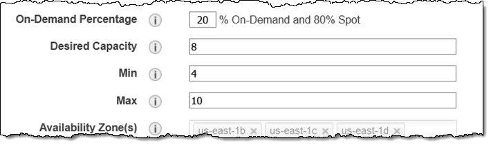

# cloudformation-elastic-beanstalk-samples

This repo contains CloudFormation templates intended to help you deploy Java Tomcat `.war` on Elastic Beanstalk and integrate with Amazon EFS as persistange storage.

### Elasticbeanstalk

You can simply upload your code and Elastic Beanstalk automatically handles the deployment, from capacity provisioning, load balancing, auto-scaling to application health monitoring. At the same time, you retain full control over the AWS resources powering your application and can access the underlying resources at any time.

## Prerequisites

The following must be done before following this guide:

- [Setup an AWS account.](https://aws.amazon.com/premiumsupport/knowledge-center/create-and-activate-aws-account/)
- [Configure the AWS CLI with user credentials.](https://docs.aws.amazon.com/cli/latest/userguide/cli-chap-configure.html)
- [Install AWS CLI.](https://docs.aws.amazon.com/cli/latest/userguide/cli-chap-install.html)

## Overview of the Stack



There are two environments one for training and one for production, training and produciton environments are divided in separate stack (VPC, EB Stack, S3, EFS...).

Training envoirment is with 1 t2 micro instance, Production stack is with min 1 C1.xlarge ec2 max N instance in Autoscalling group.

App is deployed Elastic Beanstalk environment, Statics files and DB files are stored in Multi AZ EFS volumn, application environment is designed for scalability and high availability.

## How does deploy work



### 1. Deploy S3 Artifacts, upload artifacts files to be used by Elastic Beanstalk

Argument: -d training|production

```
$bash deploy-s3.sh -d training
```

Retrieve deployed s3 bucket name, then upload static files to `/static`

```
aws s3 cp YOUR_STATIC_FILES_Path/ s3://DEPLOYED_S3_BUCKET/static --recursive
```

Upload DB file to root path

```
aws s3 cp YOUR_DB_FILE s3://DEPLOYED_S3_BUCKET
```

Upload `.war` file to `/java` level

```
aws s3 cp YOUR_DB_FILE s3://DEPLOYED_S3_BUCKET/java
```

#### 2. Deploy VPC, subsets, security groups and stack related roles.

#### 3. Deploy EFS volumn in VPC

#### 4. Deploy a temporary EC2 server used to add the necessary Elastic Beanstalk scripts to the Project source code and compress config files and .warfile to zip file.

#### 5. Deploy `.war` from S3 to AWS Elastic Beanstalk

Simply run below commend with grgument: -d training|production:

```
$bash deploy.sh -d production
```

<b>Note:</b> There are few variables in `deploy.sh` and `deploy-s3.sh` like REGION, STACK_NAME, you can modify them to yours one.

## Production environment for the limited release

You can change autoscalling configuration to reduce of enhance availability and reliability. Edit `deploy.sh` and set `WEB_ASG_MAX` value to smaller or larger number. eg. 1. and then redeploy the stack by run `$bash deploy.sh`.

Alternatively you can go to AWS Autoscaling console, manually set the Desired Capacity, Min or Max value.


